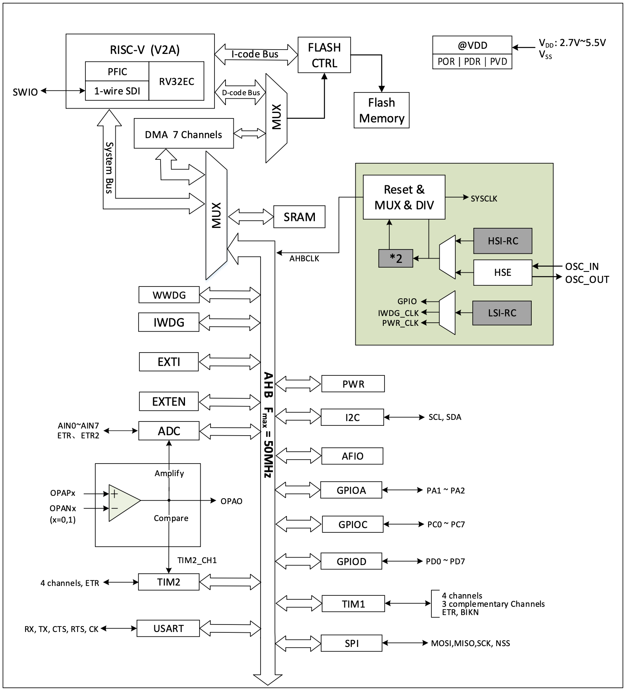
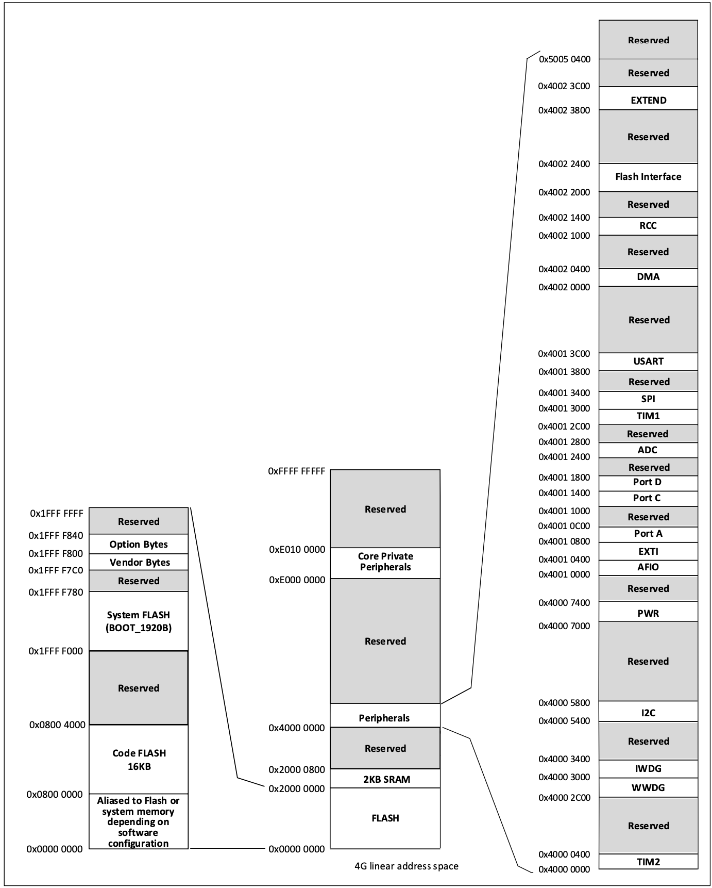
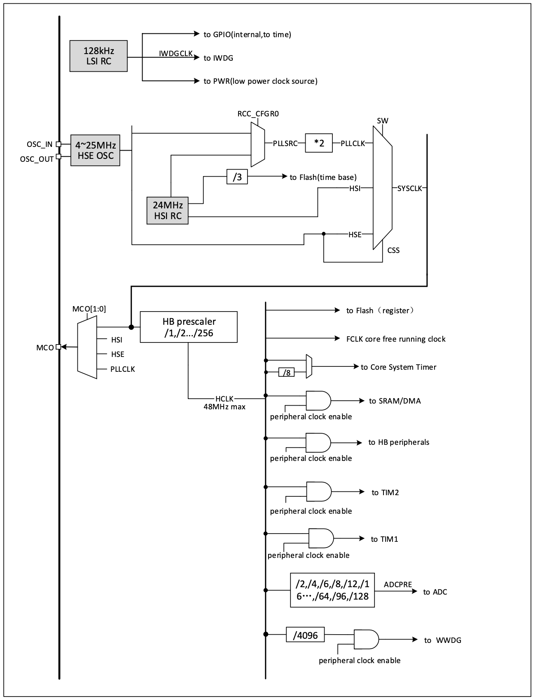
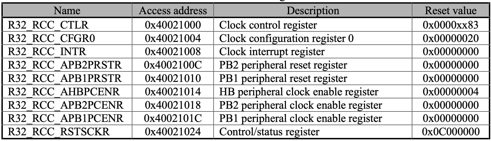
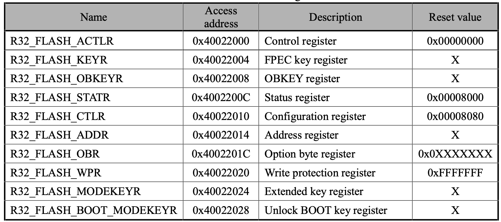
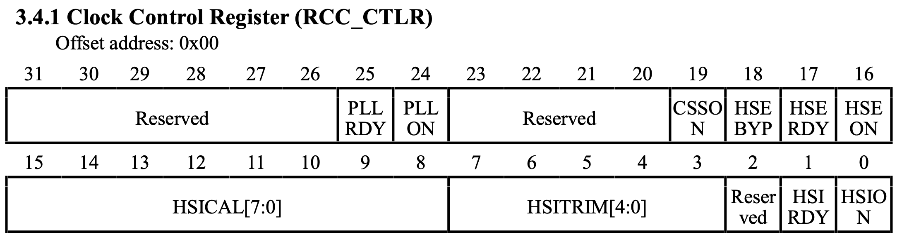
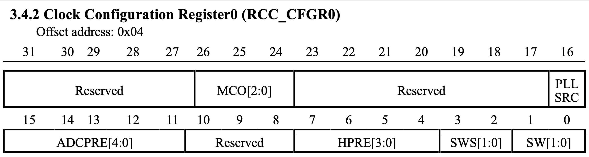
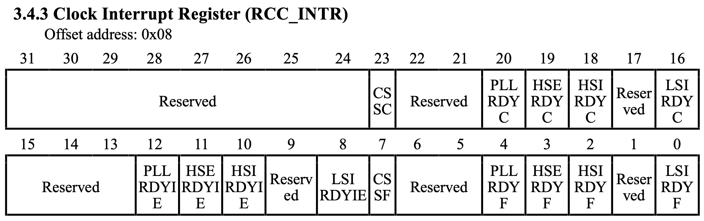
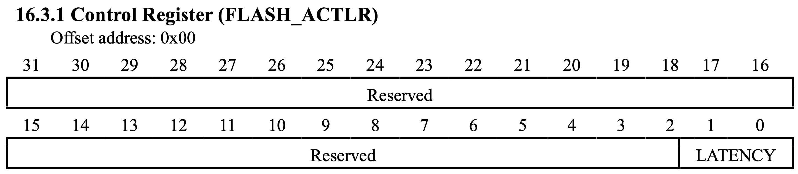

# Bare blinky

## The goal

I have messed with electronics for quite some time now, pretty much ever since I started programming. Actually, I learned basic C programming by playing in Arduino IDE. So I have a decent understanding of how to write basic programs that run on Arduino-like compatible microcontrollers; but I have a mediocre understanding of what is actually going on when I use the Arduino or the chip's framework.

So I want to go down the software stack and understand what really happens. Making an LED blink, an extremely basic task, in assembly seems like a proper way to start.

## The setup

I bought a [CH32V003 kit](https://es.aliexpress.com/item/1005005834050641.html) a while back ago with this goal in mind.

It's a microcontroller based on QuingKe RISC-V2A, 2KB SRAM, 16KB FLASH, PFIC and comes with a bunch of very common peripherals (e.g. I2C, USART, SPI, ADC, etc). The kit also includes a WCH-LinkE, a USB to SWIO bridge, which is used to program the microcontroller and monitor the USART interface.

I will be using PlatformIO to manage the project, although that isn't really relevant to this post.

## The plan

### What do we need?

The CH32V003 kit's PCB has an LED connected to GPIO D4 which emits light when that pin is low. So we need a way to manipulate the GPIO pin. Then we need a way to time the actions perfomed on the GPIO pin, so that the LED actually blinks and it does so at a constant rate.

The following block diagram depicts the CH32V003 system architecture:

There are three GPIO ports: GPIOA (PA1-PA2), GPIOC (PC0-PC7) and GPIOD (PD0-PD7) which are completely seperate GPIO controllers. Like most peripherals, they are accessed through the [AHB bus](https://en.wikipedia.org/wiki/Advanced_Microcontroller_Bus_Architecture). Each of these peripheral controllers has a set of registers that control the behaviour of the actual peripheral, and each of these registers is wired to the bus. Additionally, although not specified in the block diagram, the CH32V003 core has a system tick counter which we can use to time the GPIO actions. Like the peripherals on the AHB bus, it has a set of registers that control its behaviour.

This is what's called [Memory Mapped IO](https://en.wikipedia.org/wiki/Memory-mapped_I/O_and_port-mapped_I/O), and it is very common in microcontrollers. The registers from the peripheral controllers are each assigned a unique memory address. Therefore, interfacing with each register translates to a read and/or write operation from/to the bus. The CH32V003 has the following memory map:

Note that FLASH and SRAM are also peripherals and, while they are connected on different buses, are accesed in the same way as any other peripherals. This means that all components are wired in a way such that when the RISC-V2A core selects an address to read/write to, the correct bus and peripheral controller register is enabled and given access to the bus. So to us, the RISC-V2A core programmers, accessing any peripheral analogous to reading/writing data to memory.

According to the memory map diagram, the GPIO port D registers are located between addresses `0x40011400` and `0x40011800`, and, though not specified, the system tick timer's registers are located in the Core Private Peripherals section (`0xe000000` to `0xe0100000`).

### System clock setup

Before setting anything else up we should initialize the system clock. After reset, the CH32V003 uses the HSI (High Speed Internal) oscillator at 24MHz as a clock source. The [PLL (Phase Locked Loop)](https://en.wikipedia.org/wiki/Phase-locked_loop), used to multiply the input clock source, is disabled. An HSE (High Speed Extenal) oscillator 4-25MHz can also be used as a clock source which is disabled after reset; up to de user to set it up on every startup.

The following diagram shows the system clock tree block diagram:

A few important notes about the clock tree:
- SYSCLK output is multiplexed between HSI, HSE, HSI\*2 and HSE\*2
- AHB clock source can be prescaled (dividable by: 1, 2, ..., 256)
- Core System Timer can be divided by 8.

Before doing anything else the SYSCLK must be configured. So let's configure it at 48MHz, as it is the maximum supported frequency. The steps needed to do this are:

1. Enable HSI and PLL
2. Turn off prescaler (do not divide AHB clock) and select HSI as PLL source
3. Configure flash to use 1 cycle latency (recommended when 24MHz <= SYSCLK <= 48MHz)
4. Clear RCC interrupt flags
5. Wait until PLL is ready
6. Select PLL as system clock
7. Wait until PLL is used as system clock

All of this can be done through the RCC (Reset and Clock Control) registers, with base address `0x40021000`:

and the FLASH registers, with base address `0x40022000`:

More specifically, we'll need the following registers:

**R32_RCC_CTLR**

**R32_RCC_CFGR0**

**R32_RCC_INTR**

**R32_FLASH_ACTLR**

**Note**: the description of each field for all registers is left out for brevity.

First, HSI and PLL can be enabled through R32_RCC_CTLR's bit 0 (HSION) and bit 24 (PLLON).

### GPIO port setup

### System tick counter as timer

### Blinky